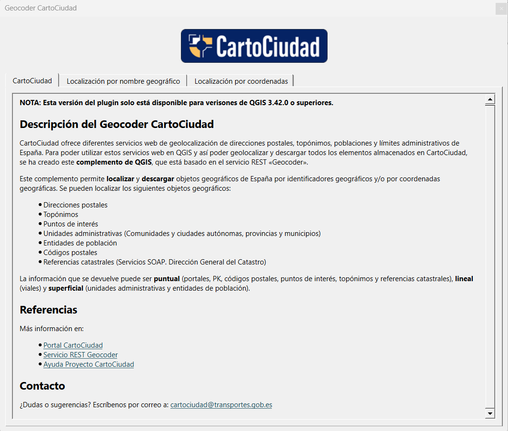
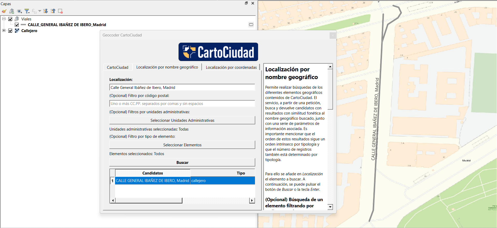
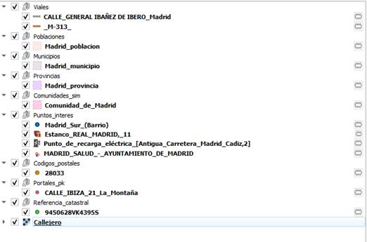
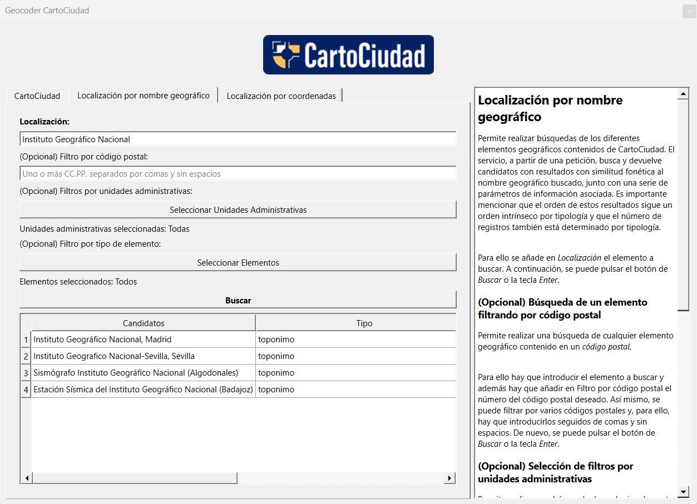
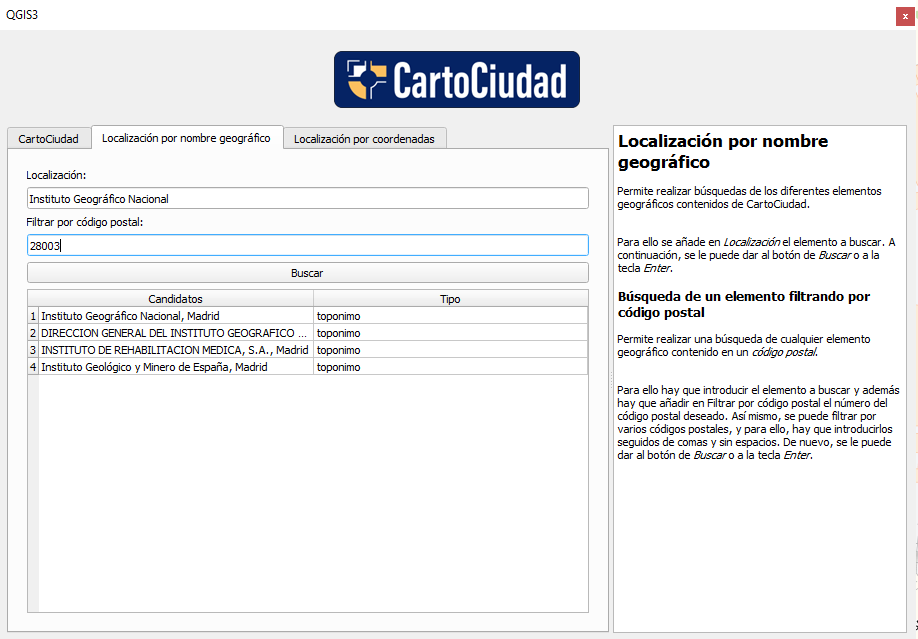
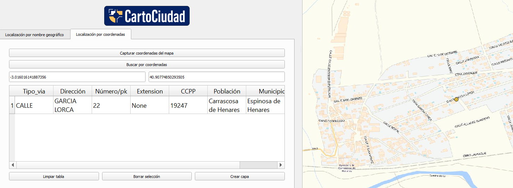

#  Geocoder CartoCiudad 

## ✍️ Descripción del plugin

CartoCiudad ofrece diferentes servicios web de geolocalización de direcciones postales, topónimos, poblaciones y límites administrativos de España.
 
Para poder utilizar estos servicios web en QGIS y así poder geolocalizar y descargar todos los elementos almacenados en CartoCiudad, se ha creado este **complemento de QGIS**, que está basado en servicio REST «Geocoder».
 
 
 
---

<a name="contenidos"></a>

## 📇 Contenidos

* 🛠 [Funcionalidades](#funcionalidades)
  * 🔸 [Localización por nombre geográfico](#nombregeografico)
  * 🔸 [Localización por coordenadas geográficas](#coordenadas)
* 🚀 [Instalación](#instalacion)
* 📁 [Estructura del código](#estructura)
* ⛲️ [Referencias](#referencias)

---

## 🛠 Funcionalidades <a name="funcionalidades"></a>

Este complemento permiete **localizar** y **descargar** objetos geográficos de España por identificadores geográficos y/o por coordenadas geográficas. 

Se pueden localizar los siguientes objetos geográficos:
 
  * Direcciones postales
 
  * Topónimos
 
  * Puntos de Interés
 
  * Unidades administrativas
 
  * Poblaciones
 
  * Códigos postales
 
  * Referencias catastrales (Servicios SOAP. Dirección General de Catastro)
 
La información que se devuelve puede ser **puntual** (portales, PK, códigos postales, puntos de interés y referencias catastrales), **lineal** (viales) y **superficial** (unidades administrativas y entidades de población).
tiene menú contextual

---

### 🔸Localización por nombre geográfico <a name="nombregeografico"></a>

[👆 Volver](#contenidos)

Permite realizar búsquedas de los diferentes elementos geográficos contenidos de CartoCiudad.

Para ello se añade en *Localización* el elemento a buscar, por ejemplo la vía *General Ibañez de Íbero, Madrid*. Una vez escrita la dirección se puede pulsar el botón de *Buscar* o la tecla *Enter*.

 *Ejemplo de búsqueda de un vial*:



🔹 **Navegador de capas**

Las capas se ven en el navegador de capas según grupo a la tipología a la que pertecezca, en la imágen anterior se aprecia la capa de Viales, y la capa se nombra con el tipo de vía, el nombre de la vía y la población en la que se encuentra. Otras tipologías de elementos se nombran de otras formas según se requiera. Por ejemplo, las capas dentro del grupo de la tipología códigos postales solo se nombran con el código postal. 

Además, las capas se representan con un estilo determinado según la tipología del elemento y tiene activadas las etiquetas que coinciden con el nombre de la capa. En el caso de expendedurías y puntos de recarga los símbolos son iconos concretos.

*La simbología y nombres según la tipología del grupo de capas es la siguiente*:



También se pueden hacer varias capas del mismo candidato y se diferencian unos con otros con el número que aparece al final del nombre de la capa.

🔹 **Tabla de resultados**

Para una visualización optima de las tablas de resultados, se puede interactuar con el tamaño de los campos.

🔹 **Búsqueda de un elemento filtrando por código postal**

Permite realizar una búsqueda de cualquier elemento geográfico contenido en un código postal. 
Para ello hay que introducir el elemento a buscar y además hay que añadir en *Filtrar por código postal* el número del código postal deseado. Así mismo, se puede filtrar por varios códigos postales, y para ello, hay que introducirlos seguidos de comas y sin espacios. También, una vez escritos los CCPP se puede pulsar el botón de *Buscar* o la tecla *Enter*.

 *Ejemplo de búsqueda del Instituto Geográfico Nacional*:



 *Ejemplo de búsqueda del Instituto Geográfico Nacional del código postal 28003*:
 



---

### 🔸Localización por coordenadas geográficas <a name="coordenadas"></a>

[👆 Volver](#contenidos)

Se puede obtener la dirección postal de cualquier punto del territorio español a partir de sus coordenadas.

Para ello hay dos métodos:

🔹 **Capturar coordenadas en el mapa**:
Una vez seleccionado el botón de *Capturar coordenadas del mapa*, hay que seleccionar cualquier punto en el poyecto de trabajo, y si el servicior REST Geocoder geolocaliza una dirección, devuelve el resultado.


🔹 **Buscar por coordenadas**:
También se puede buscar una dirección si se tienen sus coordenadas geográficas (latitud y longitud en WGS84).

Para ello hay que segur los siguientes pasos:

1. Rellenar los dos campos:
 * *Introduzca lognitud geográfica*
 * *Introduzca latitud geográfica*

2. Pulsar al botón *Buscar por coordenadas* o tecla *Enter*

 *Ejemplo de búsqueda por coordenadas geográficas*:
 


Además se tiene la funcionalidad de seleccionar o deseleccionar todas las capas buscadas mediante el botón _(De)seleccionar todo_.

🔹 **Navegador de capas**

Las capas se añaden en un grupo llamado *Resultados_reverse* y cada capa se llama con el tipo de vía, el nombre de la vía, el portal/pk y la población. Además, en la representación del punto también se muestra una etiqueta con la misma información.

También se pueden hacer varias capas del mismo candidato y se diferencian unos con otros con el número que aparece al final del nombre de la capa.


🔹 **Tabla de resultados**

Para una visualización optima de las tablas de resultados, se puede interactuar con el tamaño de los campos.

---

## 🚀 Instalación <a name="instalacion"></a>

[👆 Volver](#contenidos)

Hay varias formas de instalar el plugin:

a) Desde QGIS (complementos -> administrar e instalar complementos). Se buscaría el plugin *Geocoder CartoCiudad*, donde se puede ver toda la información del *plugin*, a partir de sus metadatos, y se seleccionaría la opción de *Instalar complemento*.

b) Desde el repositorio oficial de complementos https://plugins.qgis.org/plugins. Se buscaría el plugin *Geocoder CartoCiudad*, se descargaría y se importaría desde complementos -> administrar e instalar complementos -> instalar a partir de zip.

c) Desde este repositorio, en la parte de despliegues (releases): https://github.com/IDEESpain/PluginQGISCartociudad/releases. Una vez descargado, se instalaría en QGIS desde complementos -> administrar e instalar complementos -> instalar a partir de zip.

---

## 📁 Estructura del código <a name="estructura"></a>

[👆 Volver](#contenidos)

```any
/
├── docs 📁               # Recursos de imágenes del README
├── images 🌈             # Imágenes usadas en el plugin
├── LICENSE 📢            # Licencia              
├── metadata.txt 📁       # Metadatos
├── main.py 📁            # Integración de elementos
├── name.py 📁            # Localización por nombre geográfico
├── reverse 📁            # Localización por coordenadas
└── estilos 📁            # Simbología QGIS
```
---

## ⛲️ Referencias <a name="referencias"></a>

[👆 Volver](#contenidos)

* [Portal CartoCiudad](https://www.cartociudad.es/web/portal)
* [Guía Técnica de Servicios Web](https://www.idee.es/resources/documentos/Cartociudad/CartoCiudad_ServiciosWeb.pdf)
* [Ayuda proyecto CartoCiudad](https://www.idee.es/resources/documentos/Cartociudad/StoryMap.html)
