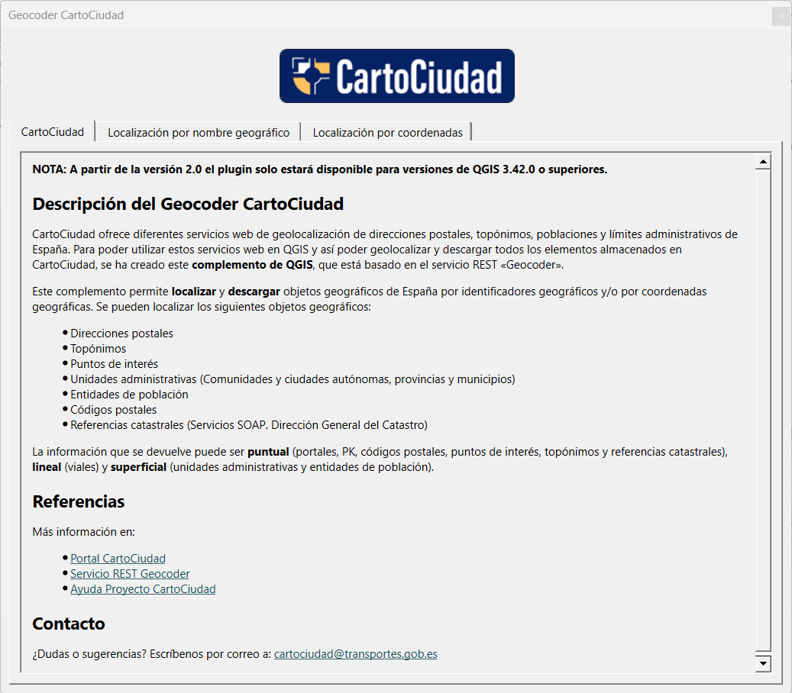
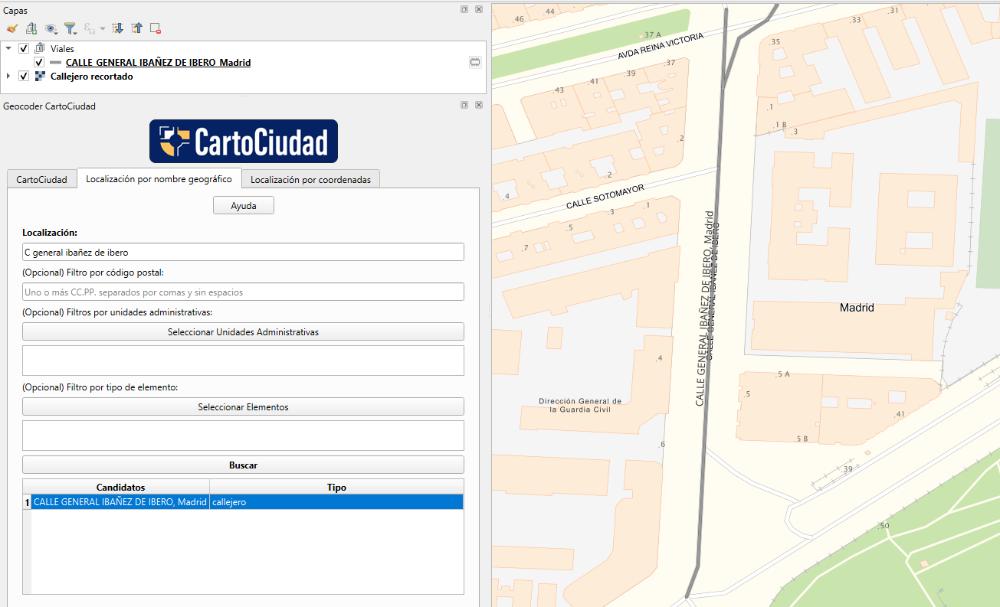
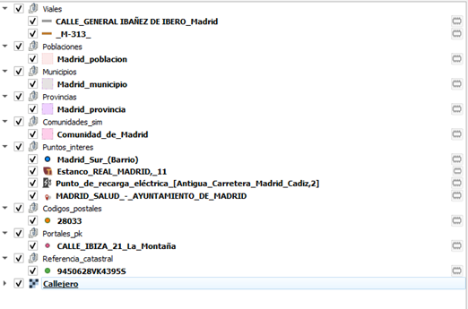
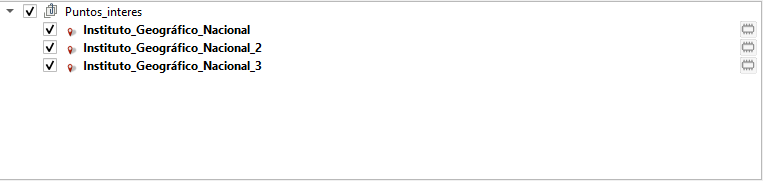
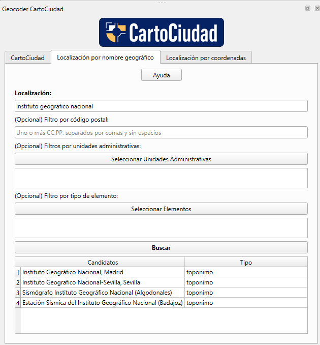
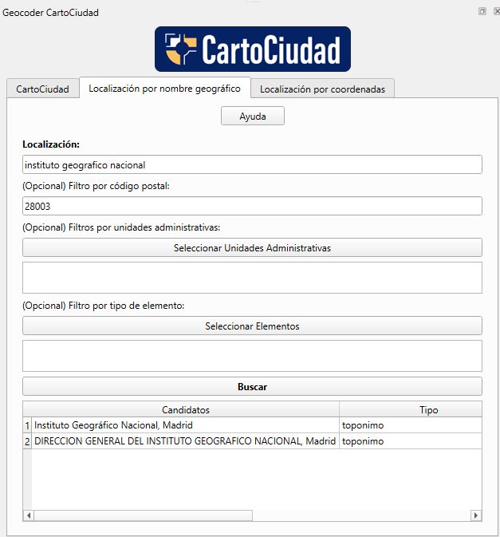
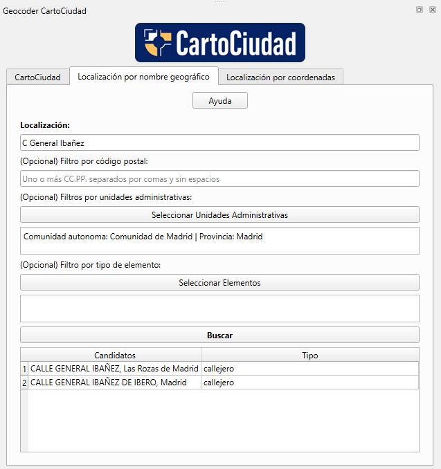
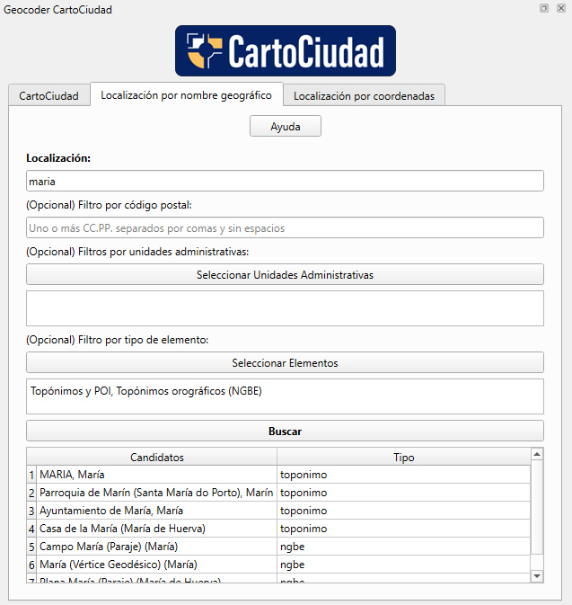
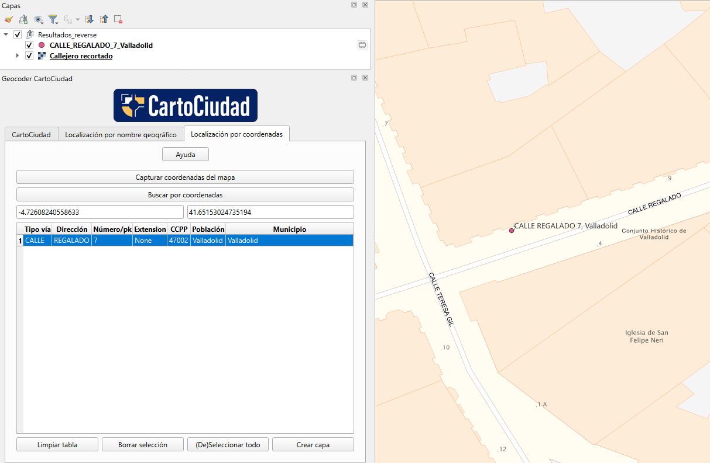

#  Geocoder CartoCiudad 

⚠️ **NOTA** ⚠️

A partir de la versión 2.0 el plugin solo estará disponible para versiones de QGIS 3.42.0 o superiores


## ✍️ Descripción del plugin

CartoCiudad ofrece diferentes servicios web de geolocalización de direcciones postales, topónimos, poblaciones y límites administrativos de España.
 
Para poder utilizar estos servicios web en QGIS y así poder geolocalizar y descargar todos los elementos almacenados en CartoCiudad, se ha creado este **complemento de QGIS**, que está basado en servicio REST «Geocoder».
 
 
 
---

<a name="contenidos"></a>

## 📇 Contenidos

* 🛠 [Funcionalidades](#funcionalidades)
  * 🔸 [Localización por nombre geográfico](#nombregeografico)
  * 🔸 [Localización por coordenadas geográficas](#coordenadas)
* 🚀 [Instalación](#instalacion)
* ↗️ [Exportación](#exportacion)
* 📄 [Documentación auxiliar](#auxiliar)
* 📁 [Estructura del código](#estructura)
* ⛲️ [Referencias](#referencias)

---

## 🛠 Funcionalidades <a name="funcionalidades"></a>

Este complemento permiete **localizar** y **descargar** objetos geográficos de España por identificadores geográficos y/o por coordenadas geográficas. 

Se pueden localizar los siguientes objetos geográficos:
 
  * Direcciones postales
 
  * Topónimos
 
  * Puntos de Interés
 
  * Unidades administrativas (Comunidades y ciudades autónomas, provincias y municipios)
 
  * Entidades de Población 
 
  * Códigos postales
 
  * Referencias catastrales (Servicios SOAP. Dirección General de Catastro)
 
La información que se devuelve puede ser **puntual** (portales, PK, códigos postales, puntos de interés, topónimos y referencias catastrales), **lineal** (viales) y **superficial** (unidades administrativas y entidades de población).
tiene menú contextual

---

### 🔸Localización por nombre geográfico <a name="nombregeografico"></a>

[👆 Volver](#contenidos)

Permite realizar búsquedas de los diferentes elementos geográficos contenidos de CartoCiudad. El servicio a partir de una petición busca y devuelve candidatos con los resultados con similitud fonética al nombre geográfico buscado, junto con una serie de parámetros de información asociada. Es importante mencionar que el orden de estos resultados sigue un orden intriseco por tipología y que el número de registros también está determinado por tipología.

Para ello se añade en *Localización* el elemento a buscar, por ejemplo la vía *General Ibañez de Íbero, Madrid*. Una vez escrita la dirección se puede pulsar el botón de *Buscar* o la tecla *Enter*.

 *Ejemplo de búsqueda de un vial*:



🔹 **Navegador de capas**

Las capas se ven en el navegador de capas según grupo a la tipología a la que pertecezca, en la imágen anterior se aprecia la capa de Viales, y la capa se nombra con el tipo de vía, el nombre de la vía y la población en la que se encuentra. Otras tipologías de elementos se nombran de otras formas según se requiera. Por ejemplo, las capas dentro del grupo de la tipología códigos postales solo se nombran con el código postal. 

Además, las capas se representan con un estilo determinado según la tipología del elemento y tiene activadas las etiquetas que coinciden con el nombre de la capa. En el caso de expendedurías y puntos de recarga los símbolos son iconos concretos.

*La simbología y nombres según la tipología del grupo de capas es la siguiente*:



También se pueden hacer varias capas del mismo candidato y se diferencian unos con otros con el número que aparece al final del nombre de la capa.



🔹 **Tabla de resultados**

Para una visualización optima de las tablas de resultados, se puede interactuar con el tamaño de los campos.

🔹 **(Opcional) Búsqueda de un elemento filtrando por código postal**

Permite realizar una búsqueda de cualquier elemento geográfico contenido en un código postal. 
Para ello hay que introducir el elemento a buscar y además hay que añadir en *Filtrar por código postal* el número del código postal deseado. Así mismo, se puede filtrar por varios códigos postales, y para ello, hay que introducirlos seguidos de comas y sin espacios. También, una vez escritos los CCPP se puede pulsar el botón de *Buscar* o la tecla *Enter*.

 *Ejemplo de búsqueda del Instituto Geográfico Nacional*:



 *Ejemplo de búsqueda del Instituto Geográfico Nacional del código postal 28003*:
 


🔹 **(Opcional) Búsqueda de un elemeto por unidad administrativa**

Permite realizar una búsqueda de cualquier elemento geográfico filtrando por unidad administrativa: municipios, provincias y/o comunidades autónomas. Por defecto se encuentran deseleccionados, de manera que busca en todos. Se pueden usar de manera conjunta para encontrar más rápido la UA deseada.

Para ello se debe pulsar en el botón de *Filtros avanzados* y seleccionar la unidad administrativa por la que se quiere filtrar. Se pueden usar las distintas unidades a la vez y seleccionar varios de la misma unidad administrativa.

*Ejemplo de búsqueda de la calle General Ibañez en la provincia de Madrid (Comunidad de Madrid)*:



🔹 **(Opcional) Búsqueda de un elemento por tipo**

Permite realizar una búsqueda de cualquier elemento geográfico filtrando por tipología. Por defecto se búscan  todos los tipos de elementos, al igual que si se deseleccionan todos ellos.

Los elementos que se incluyen son los siguientes:

  * **Entidades de población**
  * **Municipios**
  * **Provincias**
  * **Comunidades y ciudades autónomas**
  * **Topónimos y POI**
  * **Viales (urbanos)**
  * **Viales (interurbanos)**
  * **Portales y puntos kilométricos**
  * **Expendidurías**
  * **Puntos de recarga eléctrica**
  * **Topónimos orográficos (NGBE)**

Para ello se debe pulsar el botón *Seleccionar elementos* y marcar aquellos que queramos que se incluyan en la búsqueda. Una vez marcados todos los tipos se pulsa *Aceptar* o la tecla *Enter*. A continuación, para realizar la búsqueda se debe pulsar de nuevo la tecla *Enter* o el botón de *Buscar*.

*Ejemplo de búsqueda de IGN con filtro en toponimo y ngbe*




**🔖 Se pueden usar todos los tipos de filtros opcionales a la vez para ajustar la búsqueda**

---

### 🔸Localización por coordenadas geográficas <a name="coordenadas"></a>

[👆 Volver](#contenidos)

Se puede obtener la dirección postal de cualquier punto del territorio español a partir de sus coordenadas. Los campos longitud y latitud que se devuelven no son los que se muestran como parámetros de entrada en la petición, sino los correspondientes a la entidad que se devuelve en el resultado.

Para ello hay dos métodos:

🔹 **Capturar coordenadas en el mapa**:
Una vez seleccionado el botón de *Capturar coordenadas del mapa*, hay que seleccionar cualquier punto en el poyecto de trabajo, y si el servicior REST Geocoder geolocaliza una dirección, devuelve el resultado.


🔹 **Buscar por coordenadas**:
También se puede buscar una dirección si se tienen sus coordenadas geográficas (latitud y longitud en WGS84; EPSG:4326).

Para ello hay que segur los siguientes pasos:

1. Rellenar los dos campos:
 * *Introduzca lognitud geográfica*
 * *Introduzca latitud geográfica*

2. Pulsar al botón *Buscar por coordenadas* o tecla *Enter*

 *Ejemplo de búsqueda por coordenadas geográficas*:
 


Además se tiene la funcionalidad de seleccionar o deseleccionar todas las capas buscadas mediante el botón _(De)seleccionar todo_.

🔹 **Navegador de capas**

Las capas se añaden en un grupo llamado *Resultados_reverse* y cada capa se llama con el tipo de vía, el nombre de la vía, el portal/pk y la población. Además, en la representación del punto también se muestra una etiqueta con la misma información.

También se pueden hacer varias capas del mismo candidato y se diferencian unos con otros con el número que aparece al final del nombre de la capa.


🔹 **Tabla de resultados**

Para una visualización optima de las tablas de resultados, se puede interactuar con el tamaño de los campos.

---

## 🚀 Instalación <a name="instalacion"></a>

[👆 Volver](#contenidos)

Hay varias formas de instalar el plugin:

a) Desde QGIS (complementos -> administrar e instalar complementos). Buscar el plugin *Geocoder CartoCiudad* y se seleccionar la opción de *Instalar complemento*.

b) Desde el repositorio oficial de complementos https://plugins.qgis.org/plugins. Buscar el plugin *Geocoder CartoCiudad*, descargar e importar desde complementos -> administrar e instalar complementos -> instalar a partir de zip.

c) Desde este repositorio, en la parte de despliegues (releases): https://github.com/IDEESpain/PluginQGISCartociudad/releases. Una vez descargada la versión deseada, se instala en QGIS desde complementos -> administrar e instalar complementos -> instalar a partir de zip.

---

## ↗️ Exportación de capas <a name="exportacion"></a>

[👆 Volver](#contenidos)

La exportación de las capas se puede hacer de las siguientes formas:

a) Manualmente y de manera individual.

b) Mediante la herramienta de *Unir capas vectoriales* y posteriormente exportar la capa resultante.

c) Mediante el complemento expermiental externo *QConsolidate3*.


## 📄 Documentación auxiliar <a name="auxiliar"></a>

[👆 Volver](#contenidos)

Tres tablas correspondientes con los nombres y códigos respectivos de comunidades y ciudades autónomas, provincias y municipios, recopiladas por CartoCiudad, procedentes del Instituto Geográfico Nacional. Con dichos nombres se pueden hacer una serie de filtrados en el *plugin*.


## 📁 Estructura del código <a name="estructura"></a>

[👆 Volver](#contenidos)

```any
/
├── images 🌈             # Imágenes usadas en el plugin
├── LICENSE 📢            # Licencia              
├── metadata.txt 📁       # Metadatos
├── main.py 📁            # Integración de elementos
├── name.py 📁            # Localización por nombre geográfico
├── reverse 📁            # Localización por coordenadas
├── estilos 📁            # Simbología QGIS  
└── compact.py 📁         # Archivo compatibilidad QT5-QT6                                                                    
```
---

## ⛲️ Referencias <a name="referencias"></a>

[👆 Volver](#contenidos)

* [Portal CartoCiudad](https://www.cartociudad.es/web/portal)
* [Servicio REST Geocoder](https://github.com/IDEESpain/Cartociudad)
* [Ayuda proyecto CartoCiudad](https://www.idee.es/resources/documentos/Cartociudad/StoryMap.html)
